# Prompt Manager

table of contents:
# Table of Contents

1. [Introduction](#introduction)
2. [Installation](#installation)
3. [Setting up the server](#setting-up-the-server)
4. [API Endpoints](#api-endpoints)
5. [A Tour to the Frontend App](#a-tour-to-the-frontend-app)
6. [Upcoming Features](#upcoming-features)

# Introduction

a prompt management system, implemented by **NodeJS, Express** and **Sequelize ORM** with a frontend that have a minimal design implemented with **Pico.css** library and plain **JavaScript.**

you can add, edit, mark and delete prompts in this app. 

# Installation

## Docker
TBD
## Manual

to use the app you should install the latest version of NodeJS and other required packages such as Express and Sequelize.

you can follow installation manual on the following docs:

https://nodejs.org/en/download/package-manager/current

https://expressjs.com/en/starter/installing.html

https://sequelize.org/docs/v6/getting-started/


>⚠️ To allow all frontend api fetches you should install cors middleware package after installing NodeJS and ExpressJS:
>  ```bash
>  $ npm install cors
>  ```
>


---
>💡the app database setting is configured on a local postgreSQL server. you can change the setting in **models.js** file.
>In order to use postgreSQL you can follow installation guide bellow and change the configuration parameters of the app according to your local postgre server.
https://www.postgresql.org/

# Setting up the server

the server is set to run on port **3000**. 

after finishing the installation go to projects root directory and use the following command to run the app:

```bash
node backend/app.js
```

# API endpoints

## /prompts

supported methods: **GET, POST**

### **GET:**

required body fields: **none**

- request:

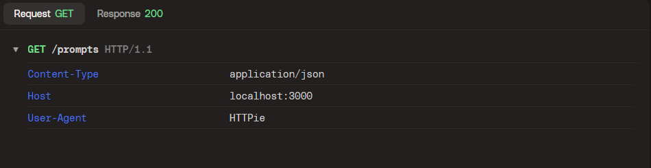

- response:

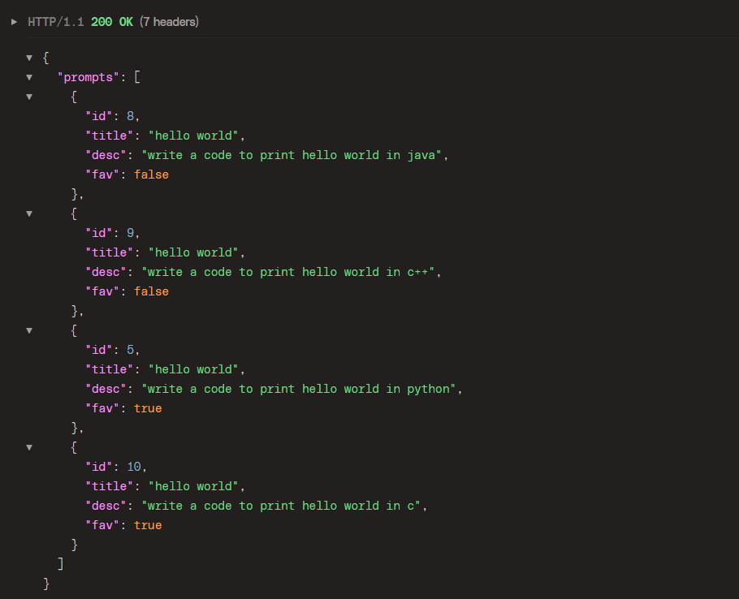

### **POST:**

required body fields: **title, desc, fav**

- request:

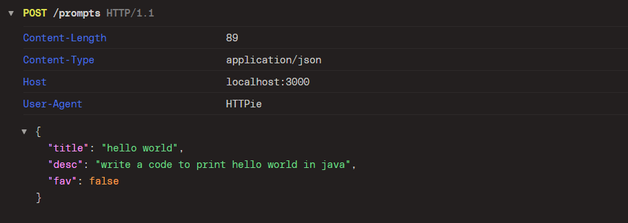

- response:

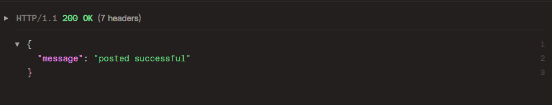

## /prompt/<id>

supported methods: **GET, PATCH, DELETE**

### **GET**

required body fields: **none**

- request:

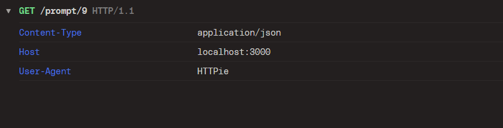

- response:

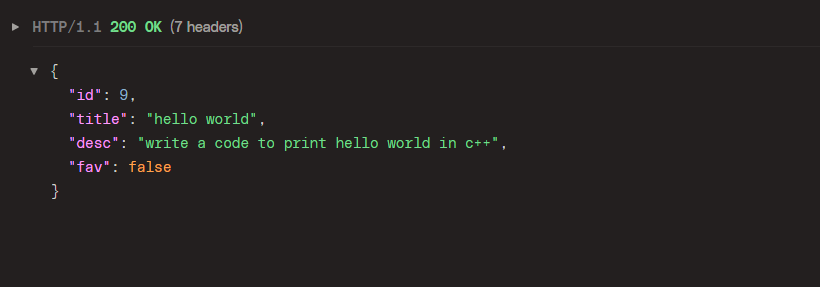

### **PATCH:**

required body fields: **none(can optionally contain title, desc and fav)**

- request:

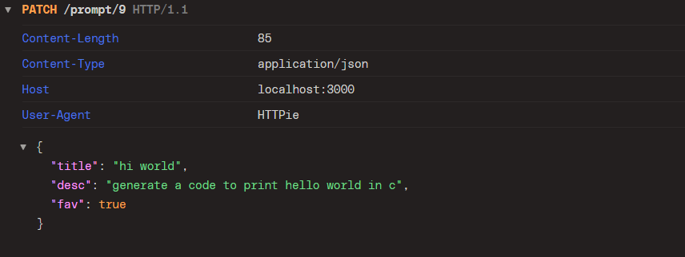

- response

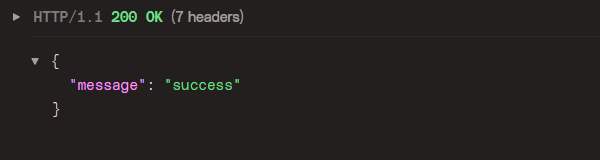

in the above api call; all possible fields of prompt with id 9 was updated. comparisson is shown in two  below figures:

- before:
    
    
    
- after:

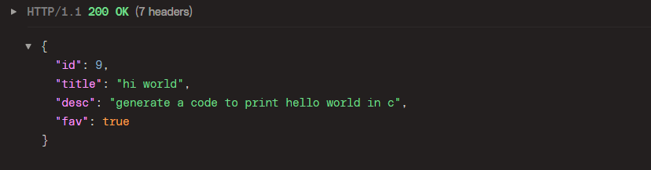

### DELETE:

required fields: **none**

- request:
    
    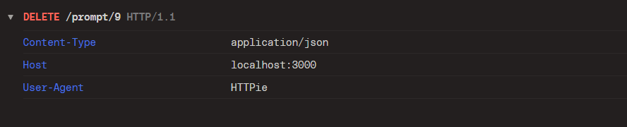
    
- response:
    
    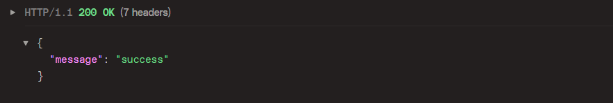
    

# A tour to the frontend app

## Adding new prompt:

at the top of the main page there is a form that asks you title and description of your new prompt. in this form, new prompts are set as not favorite by default but you can change that by checking the Favorite box.

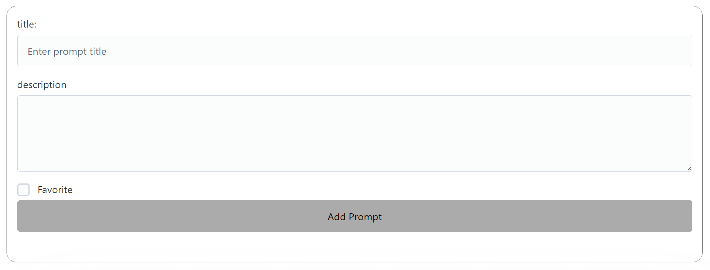

## List of existing prompts

Below the form you can see a list of your existing prompts

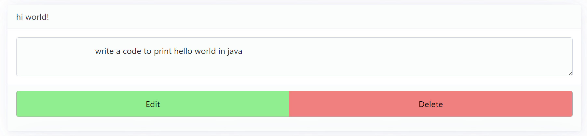

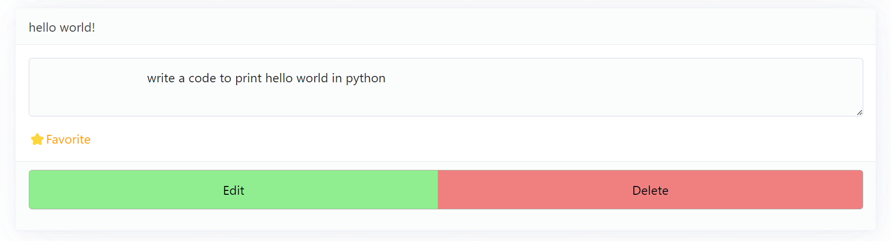

you can edit or delete any prompt you wish!

## Editing prompts

if you click on the edit button of any prompt in the list screen will automatically scroll up and you can edit your prompt in the editing for at the top.

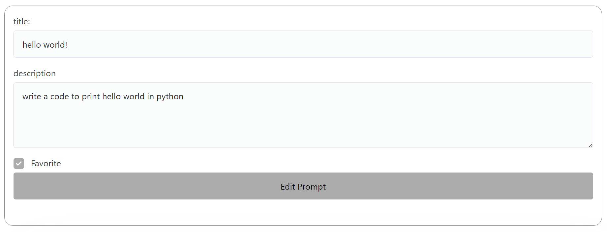

# Upcoming features

✨adding priority to prompts and sorting them according to their priority

🚀user authentication
